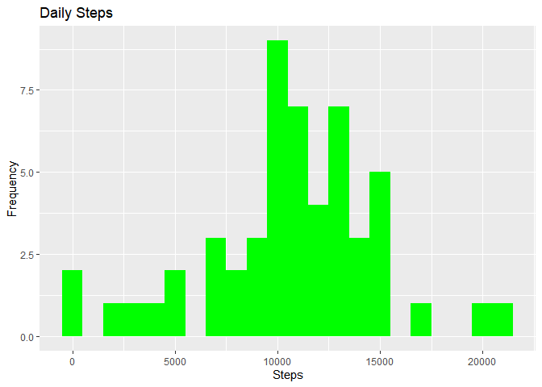
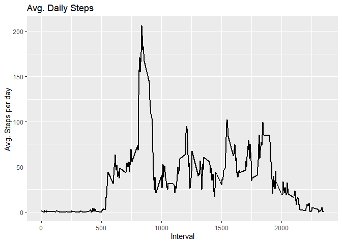
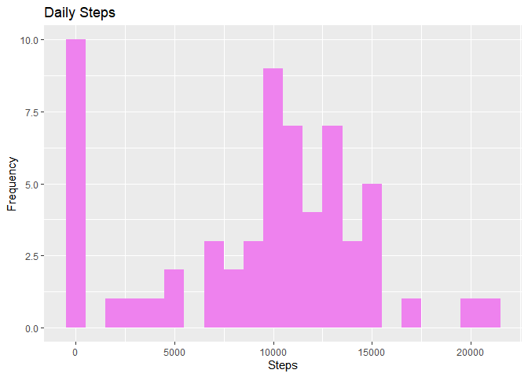
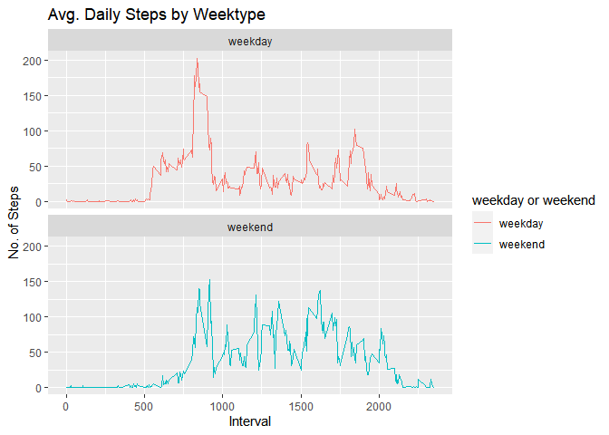

## Loading and preprocessing the data
Loading data.table library and ggplot2
Unzipping the given data


```r
library("data.table")
```

```
## Warning: package 'data.table' was built under R version 4.0.5
```

```r
library(ggplot2)
unzip("activity.zip",exdir = "data")
```

## Reading csv Data into Data.Table. 
Using the data.table function reading the csv data into the table


```r
activityDT <- data.table::fread(input = "data/activity.csv")
```

## What is mean total number of steps taken per day?

Calculate the total number of steps taken per day
We take the given data and take out the steps column and add them together to get the total number of steps in different days.
I just use head to verify if the loaded data is correct.

```r
Total_Steps <- activityDT[, c(lapply(.SD, sum, na.rm = FALSE)), .SDcols = c("steps"), by = .(date)] 
head(Total_Steps, 10)
```

```
##           date steps
##  1: 2012-10-01    NA
##  2: 2012-10-02   126
##  3: 2012-10-03 11352
##  4: 2012-10-04 12116
##  5: 2012-10-05 13294
##  6: 2012-10-06 15420
##  7: 2012-10-07 11015
##  8: 2012-10-08    NA
##  9: 2012-10-09 12811
## 10: 2012-10-10  9900
```

Using the ggplot method plotting out total steps in a histogram to look at and analyze the data


```r
ggplot(Total_Steps, aes(x = steps)) +
    geom_histogram(fill = "green", binwidth = 1000) +
    labs(title = "Daily Steps", x = "Steps", y = "Frequency")
```

```
## Warning: Removed 8 rows containing non-finite values (stat_bin).
```

<!-- -->

Calculating and reporting the mean and median of the total number of steps taken per day by using the total steps calculated previously


```r
Total_Steps[, .(Mean_Steps = mean(steps, na.rm = TRUE), Median_Steps = median(steps, na.rm = TRUE))]
```

```
##    Mean_Steps Median_Steps
## 1:   10766.19        10765
```

## What is the average daily activity pattern?
We make a time series plot (i.e. 𝚝𝚢𝚙𝚎 = "𝚕") of the 5-minute interval (x-axis) and the average number of steps taken, averaged across all days (y-axis). We do this by using the mean steps data in different intervals and then plotting it out using the ggplot system to plot out the graph. We then look at the graph to analyze average daily activity pattern.


```r
IntervalDT <- activityDT[, c(lapply(.SD, mean, na.rm = TRUE)), .SDcols = c("steps"), by = .(interval)] 
ggplot(IntervalDT, aes(x = interval , y = steps)) + geom_line(color="black", size=1) + labs(title = "Avg. Daily Steps", x = "Interval", y = "Avg. Steps per day")
```

<!-- -->

We use the max function on the steps in each interval to find out the 5-minute interval which in average contains the maximum number of steps. 

```r
IntervalDT[steps == max(steps), .(max_interval = interval)]
```

```
##    max_interval
## 1:          835
```


## Imputing missing values

We use the given data and search all the data for any missing values and count all of them to get the total no of missing values.


```r
activityDT[is.na(steps), .N ]
```

```
## [1] 2304
```

I am using the median of the given steps data to fill the data at all the places where the data is NA. The median is calculated by ignoring all the missing values.


```r
activityDT[is.na(steps), "steps"] <- activityDT[, c(lapply(.SD, median, na.rm = TRUE)), .SDcols = c("steps")]
```

Creating a new dataset that is equal to the original dataset but with the missing data filled in and saving it under a new filename


```r
data.table::fwrite(x = activityDT, file = "data/tidyData.csv", quote = FALSE)
```

We repeat the above steps with the new data to calculate average, total, mean and mediant steps from the new data that we got by replacing all the missing values from the median values. 


```r
# total number of steps taken per day
Total_Steps <- activityDT[, c(lapply(.SD, sum)), .SDcols = c("steps"), by = .(date)] 
# mean and median total number of steps taken per day
Total_Steps[, .(Mean_Steps = mean(steps), Median_Steps = median(steps))]
```

```
##    Mean_Steps Median_Steps
## 1:    9354.23        10395
```

```r
ggplot(Total_Steps, aes(x = steps)) + geom_histogram(fill = "violet", binwidth = 1000) + labs(title = "Daily Steps", x = "Steps", y = "Frequency")
```

<!-- -->

Type of Estimate | Mean_Steps | Median_Steps
First Part (with NA) | 10765 | 10765
Second Part (replacing NA with median) | 9354.23 | 10395

As we can see from the newly formed graph the the mean and median have decreased slighty from the previous analysis due to filling of the data.

## Are there differences in activity patterns between weekdays and weekends?
Loading the data from scratch just to use the orignal data again and not the tidy data we created by removing NA values. In the data we first use the POSIXct function to calculate the days from the given dates in the data. We then store all the days in weekdays and then sort our the data using grep1 function differentiating between weekday and weekends.We then specify weekday and weekend as factors. Obviously loading the data again is not necessary i just do it to document the complete process.


```r
activityDT <- data.table::fread(input = "data/activity.csv")
activityDT[, date := as.POSIXct(date, format = "%Y-%m-%d")]
activityDT[, `Day of Week`:= weekdays(x = date)]
activityDT[grepl(pattern = "Monday|Tuesday|Wednesday|Thursday|Friday", x = `Day of Week`), "weekday or weekend"] <- "weekday"
activityDT[grepl(pattern = "Saturday|Sunday", x = `Day of Week`), "weekday or weekend"] <- "weekend"
activityDT[, `weekday or weekend` := as.factor(`weekday or weekend`)]
head(activityDT, 10)
```

```
##     steps       date interval Day of Week weekday or weekend
##  1:    NA 2012-10-01        0      Monday            weekday
##  2:    NA 2012-10-01        5      Monday            weekday
##  3:    NA 2012-10-01       10      Monday            weekday
##  4:    NA 2012-10-01       15      Monday            weekday
##  5:    NA 2012-10-01       20      Monday            weekday
##  6:    NA 2012-10-01       25      Monday            weekday
##  7:    NA 2012-10-01       30      Monday            weekday
##  8:    NA 2012-10-01       35      Monday            weekday
##  9:    NA 2012-10-01       40      Monday            weekday
## 10:    NA 2012-10-01       45      Monday            weekday
```

Make a panel plot containing a time series plot (i.e. 𝚝𝚢𝚙𝚎 = "𝚕") of the 5-minute interval (x-axis) and the average number of steps taken, averaged across all weekday days or weekend days (y-axis). We do this by first recreating the tidy data and then taking out its mean in the different intervals in weekday and weekend. Then we plot out this data of average steps by week type and analyze the data.


```r
activityDT[is.na(steps), "steps"] <- activityDT[, c(lapply(.SD, median, na.rm = TRUE)), .SDcols = c("steps")]
IntervalDT <- activityDT[, c(lapply(.SD, mean, na.rm = TRUE)), .SDcols = c("steps"), by = .(interval, `weekday or weekend`)] 
ggplot(IntervalDT , aes(x = interval , y = steps, color=`weekday or weekend`)) + geom_line() + labs(title = "Avg. Daily Steps by Weektype", x = "Interval", y = "No. of Steps") + facet_wrap(~`weekday or weekend` , ncol = 1, nrow=2)
```

<!-- -->
